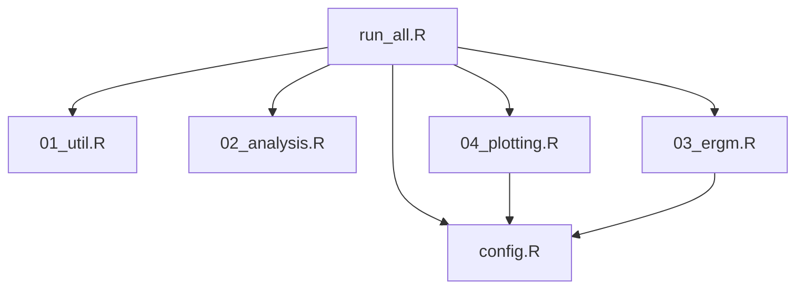

# Perceived social support modulates the relationship between social network structure and loneliness

*Running title: Perceived support modulates network effects on loneliness*

## Overview

This repository contains analysis code for a manuscript examining how social network structure and perceived social support relate to incident loneliness.

### Data 
* **Source**: Offspring cohort of the Framingham Heart Study. Baseline is defined at Exam 7, and incident loneliness is measured at Exam 9.

* **Availability**: Individual-level data from the Framingham Heart Study cannot be shared in this repository. Given this constraint, deidentified code is provided to ensure maximum trasnparency.

### Study design

- **Exposure:** Social network degree, constraint, transitivity (CC)
- **Outcome:** Incident loneliness at follow-up (binary)
- **Effect modifier:** Perceived social support (PSS), analysed across thresholds
- **Models:** IPW-weighted logistic/mixed effect logistic regression; ERGM for network structure

## Repository structure

```text
.
├── config.R        # Global settings (paths, seeds, flags)
├── 01_util.R       # Network statistics and neighbour-level utilities
├── 02_analysis.R   # Data loading, IPW estimation, GLM/GLMER models
├── 03_ergm.R       # ERGM specification and fitting
├── 04_plotting.R   # Marginal-effect plotting
├── run_all.R       # Master script to run the analysis
├── data/           # Input data (not included)
└── output/         # Figures and selected output (created at runtime)
```

###  Sourcing relationships




---


### How to run

1. Place the required Framingham Heart Study data files in the `data/` directory (filenames and formats are defined in `load_data()` in `02_analysis.R`).
2. Adjust `config.R` if needed (to run without mixed effect or ERGM analysis, negate the corresponding flags).
3. From an R session in the project root, run ```source("run_all.R")```.

### Dependencies

- R (version ≥ 4.2)
- Packages: `igraph`, `randnet`, `dplyr`, `lme4`, `emmeans`, `network`, `ergm`


